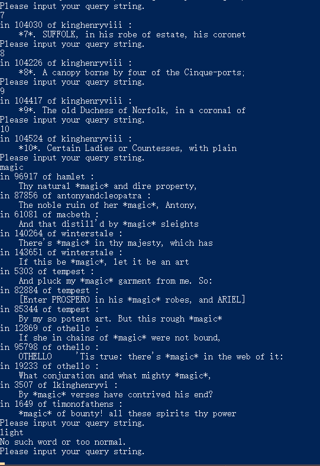

# lab1
计55 许翰翔 2015011370

## Write-up
- How long do you think this project would take you to finish?

5h

- How much time did you actually spend on this project?

很惭愧…大概花了20h…
装环境+熟悉环境大约花了一半以上的时间…
实际代码时间在2h内，代码量并不是很大。
剩下的时间基本上花在处理编译运行、从服务器上传/下载、从hdfs上传/下载。
<br>

- Acknowledge any assistance you received from anyone except assigned course readings and the course staff.

全部独立完成，其中hadoop的代码参考了04 Hadoop实现原理C - 分布式编程环境MapReduce.pdf中的代码。
<br>

- What test corpus did you load into HDFS? Where is it located (i.e. HDFS path)?

在hdfs的/user/2015011370/lab1/freword.txt中，储存了part1要求过滤掉的"noise"。
<br>

- What, if any, "noisy words" did you find as a result of your WordCount? By what criteria did you determine that they were "noisy"? Were you surprised by any of these words?

简单的使用了单词的总出现次数>100即判定为"noise"，确实会过滤掉一些不应过滤的单词，但是大体效果还是很好的。以下列举了其中的一部分：
<br>

```
oath
octavius
of
off
offence
offer
office
officer
oft
often
old
olivia
on
once
one
only
open
or
order
```
<br>

可以发现大多数确实是在任何地方都算得上高频的单词。
<br>

- Which extensions did you do? Please also detail any interesting results you found.
前4个扩展均做了（最后2个扩展不用做？）。
<br>

Part1：
    先用WordCount.java得到单词频率，之后用checkword.py，将高频单词处理出来。
<br>

Part2：
    使用InvertedIndex.java计算倒排列表，详情见之后的部分。
<br>

扩展1：
    在WordCount.java部分，map的时候使用Java的正则表达式匹配单词：
<br>

```java
    public static class TokenizerMapper extends Mapper<Object, Text, Text, IntWritable>{
        private Text outputKey = new Text();
        private IntWritable outputVal = new IntWritable(1);
        private static final String REGEX = "\\w+";
            
        public void map(Object key, Text value, Context context) throws IOException, InterruptedException {

            String line = value.toString();
            Pattern p = Pattern.compile(REGEX);
            Matcher m = p.matcher(line);
            while (m.find())
            {
                String word = m.group().toLowerCase();
                outputKey.set(word);
                context.write(outputKey, outputVal);
            }
        }
    }
```
<br>

扩展3：
    在InvertedIndex.java部分，首先用setup过滤掉"noise"，之后在map中将传进来的key（即文件中seek的偏移量，单位是字节）存入write的value中，这样就可以得到在文件中查询到的偏移量。
<br>

```java
    public static class InvertedIndexMapper extends Mapper<Object, Text, Text, Text>{

        private static final String stopWordPath = "lab1/freword.txt";

        private Text outputKey = new Text();
        private Text outputVal = new Text();
        private static final String REGEX = "\\w+";
        private Set<String> stopWords = new HashSet<String>();
        private FileSystem fs;

        protected void setup(Context context) throws IOException, InterruptedException {
            Configuration conf = new Configuration();
            fs = FileSystem.get(conf);
            FSDataInputStream dis = fs.open(new Path(stopWordPath));
            while (true) {
                String line = dis.readLine();
                if (line == null || line.isEmpty()) break;
                StringTokenizer tokenizer = new StringTokenizer(line);
                while (tokenizer.hasMoreTokens())
                    stopWords.add(tokenizer.nextToken());
            }
        }
        
        public void map(Object key, Text value, Context context) throws IOException, InterruptedException {
            FileSplit fileSplit = (FileSplit) context.getInputSplit();
            String fileName = fileSplit.getPath().getName();
            String line = value.toString();
            Pattern p = Pattern.compile(REGEX);
            Matcher m = p.matcher(line);
            while (m.find())
            {
                String word = m.group().toLowerCase();
                if (stopWords.contains(word)) continue;
                outputKey.set(word);
                outputVal.set(fileName + ":" + key.toString());
                context.write(outputKey, outputVal);
            }
        }
    }
```
<br>
扩展2与扩展4：
    使用了python处理询问，在main.py中，Dict存了"文件名""偏移量"->单词出现的那一行，InvertedIndex则存了倒排列表中是否存在这个单词。
    询问时死循环输入一个单词，返回文档中查询的结果，并用**标注单词：
<br>

```python
import os
import re

Input = open("InvertedIndex.txt", "r")

dataPath = ".\\shakespeare"
Dict = {}

for root, Dir, files in os.walk(dataPath) :
    for filename in files:
        now = open(dataPath + "\\" + filename, "r")
        Dict[filename] = {}
        cnt = 0
        for line in now:
            Dict[filename][cnt] = line.strip()
            cnt += len(line)

InvertedIndex = {}

for line in Input:
    now = line.strip("\n").split("\t")
    InvertedIndex[now[0]] = now[1].split(", ")

while 1:
    print("Please input your query string.")
    query = input()
    check = 0
    if InvertedIndex.get(query):
        for kv in InvertedIndex[query]:
            check = 1
            kv = kv.split(":")
            line = Dict[kv[0]][int(kv[1])]
            print("in", kv[1], "of", kv[0], ":\n   ", re.sub(query, "*"+query+"*", line, flags=re.I))
    if check == 0:
            print("No such word or too normal.")    
```
<br>

以下是几个例子：



## 说明
实验用到的代码均能在服务器上运行，储存在~/lab1中，mapreduce的代码直接用bash compile.sh及bash run.sh即可运行使用。